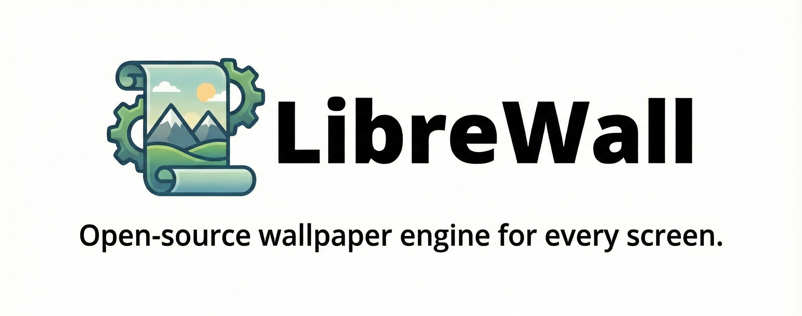

# Librewall

**The open-source, high-performance alternative to proprietary wallpaper engines.**

## Showcase

**3D Model Rendering**

**Interactive Web/App Integration**

**Customization**

## Features

Librewall supports a wide range of media types and customization options:

* **Video & GIF Support:** Seamlessly render high-quality video loops as wallpapers.
* **Interactive Webpages:** Run HTML/CSS/JS applications directly on the desktop.
* **Animated 3D Models:** Render real-time 3D scenes.
* **Future Updates:** Additional format support is currently in development.

## Performance

We prioritize system efficiency to ensure the wallpaper does not interfere with work or gaming:

* **Fullscreen Detection:** Wallpaper playback automatically pauses when fullscreen applications or games are running to free up GPU resources.
* **Foreground Rules:** Users can set specific playback rules based on the currently active foreground application.
* **Battery Saver:** Playback can be configured to pause automatically when the device is running on battery power (Laptops).

## Automation & API

Librewall is designed for power users and developers who want full control over their environment:

* **CLI Support:** Control the wallpaper engine using command-line arguments from the terminal.
* **Scripting Integration:** Integrate Librewall with external scripts (Python, Bash, etc.) via the Librewall API to trigger wallpaper changes based on system events.
* **API Support:** A full API is currently in development to allow for deeper programmatic control and plugin support.

## Contributing

This is an open-source project, and contributions are highly encouraged. We welcome help in the following areas:

* Improving the backend engine and rendering pipeline.
* Enhancing the user interface for the configuration dashboard.
* Implementing new features or format support.

## License

Librewall is licensed under the **GPL-v3** (GNU General Public License v3.0).
